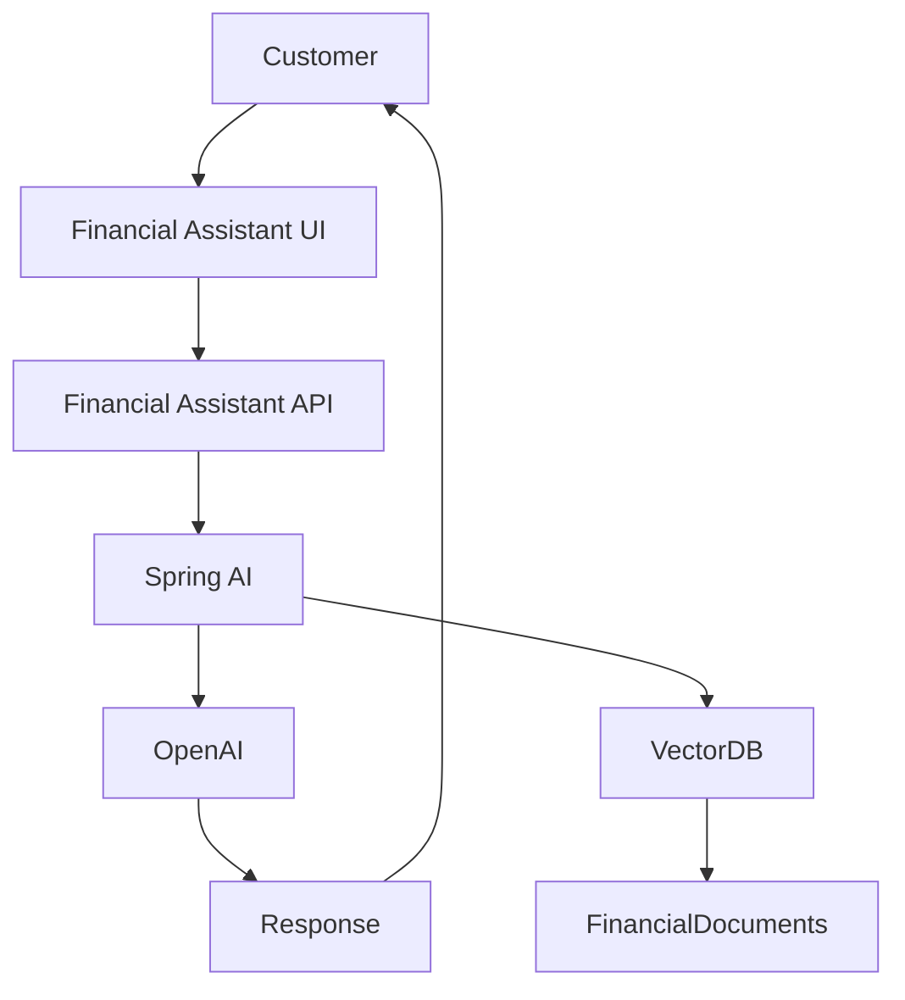
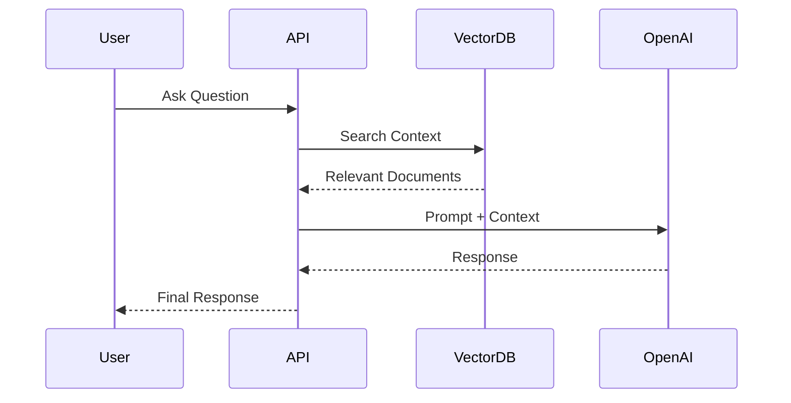

# Financial Assistant API

AI-powered backend platform for financial assistance built using Spring Boot, Spring AI, OpenAI, and Retrieval-Augmented Generation (RAG).

## Overview

Financial Assistant API is the intelligence layer behind the Financial Assistant platform.

It combines Large Language Models, Vector Search, and Retrieval-Augmented Generation (RAG) to provide accurate and context-aware financial responses.

## Features

* Spring AI Integration
* OpenAI Integration
* RAG Implementation
* Vector Search
* Financial Knowledge Base
* Context-Aware Responses
* REST APIs
* Scalable Microservice Design

## Architecture



## RAG Flow



## Technology Stack

* Java
* Spring Boot
* Spring AI
* OpenAI
* PostgreSQL
* Vector Database
* Redis
* Docker

## Project Structure

```text
src
├── controller
├── service
├── config
├── ai
├── rag
├── repository
└── model
```

## Use Cases

* Loan Eligibility Assistant
* Financial Product Guidance
* Customer Support Automation
* Contract Information Retrieval
* EMI Guidance
* Knowledge Search

## Related Projects

### Frontend UI

financial-assistant-ui

## Future Enhancements

* Multi-Agent Architecture
* Arabic Language Support
* Voice Assistant
* Customer Personalization
* Real-Time Streaming
* AI Recommendation Engine

## Author

Mohammad Adil

🏦 FinTech Backend Lead
☕ Java Architect
🤖 AI Engineer
