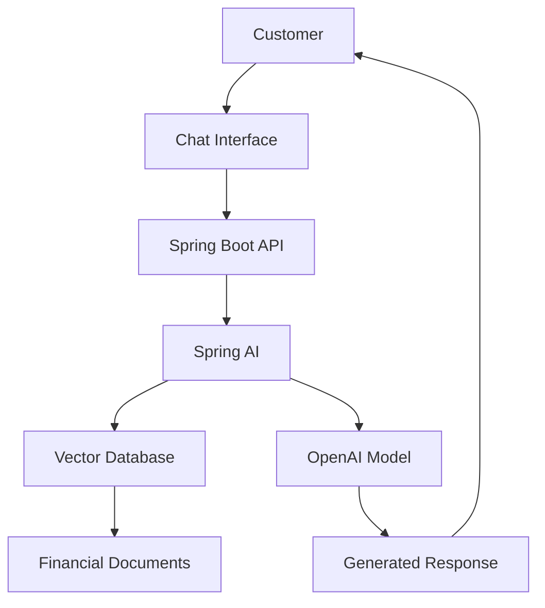
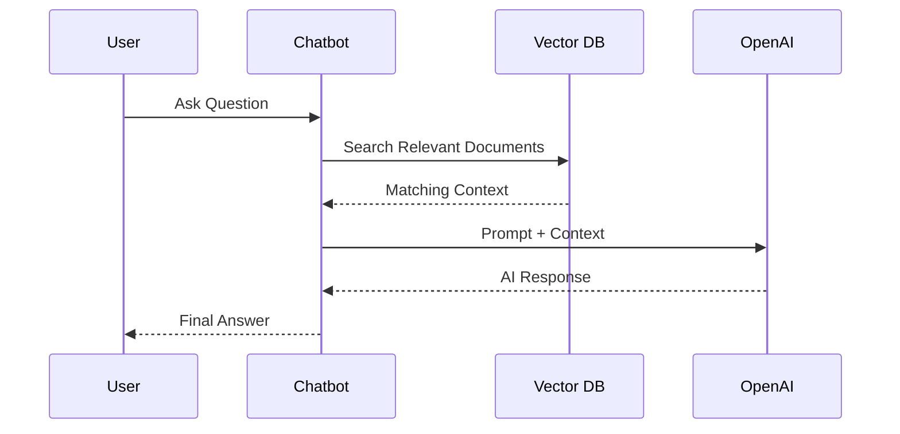

# Financial AI Assistant

An AI-powered financial chatbot built using Spring AI, OpenAI, Retrieval-Augmented Generation (RAG), and Vector Database technology to deliver accurate and context-aware financial assistance.

## Overview

Financial AI Assistant is designed to provide intelligent financial guidance by combining Large Language Models (LLMs) with enterprise knowledge retrieval.

The platform uses Retrieval-Augmented Generation (RAG) to deliver responses grounded in financial documents, policies, product information, and business knowledge.

## Key Features

* AI-powered conversational interface
* OpenAI integration
* Spring AI implementation
* Retrieval-Augmented Generation (RAG)
* Context-aware responses
* Financial knowledge search
* Document-based question answering
* Conversation memory
* Scalable microservice architecture

## Architecture



## Solution Components

| Component       | Responsibility       |
| --------------- | -------------------- |
| Chat UI         | Customer interaction |
| Spring Boot API | Backend services     |
| Spring AI       | LLM orchestration    |
| OpenAI          | Language model       |
| Vector Database | Semantic search      |
| RAG Engine      | Context retrieval    |
| Knowledge Base  | Financial documents  |

## RAG Workflow



## Technology Stack

| Layer         | Technology           |
| ------------- | -------------------- |
| Backend       | Spring Boot          |
| AI Framework  | Spring AI            |
| LLM           | OpenAI               |
| Vector Search | Pinecone / Vector DB |
| Database      | PostgreSQL           |
| Cache         | Redis                |
| Deployment    | Docker               |
| Monitoring    | ELK                  |

## Sample Use Cases

### Loan Eligibility Queries

```text
Am I eligible for a personal loan?
```

### EMI Calculation Guidance

```text
How much would my monthly installment be?
```

### Product Information

```text
What documents are required for a salary-backed loan?
```

### Contract Questions

```text
What is the repayment schedule?
```

## Chat Flow


## Security Considerations

* Secure API authentication
* Prompt validation
* Input sanitization
* Role-based access control
* Audit logging

## Future Enhancements

* Multi-language Support (Arabic & English)
* Voice Assistant Integration
* AI Agents
* Loan Recommendation Engine
* Customer Personalization
* Real-Time Financial Insights

## Business Benefits

* Reduced support workload
* Faster customer response times
* Improved customer engagement
* Consistent financial guidance
* Knowledge-driven responses

## Author

Mohammad Adil

🏦 FinTech Backend Lead
☕ Java Architect
🤖 AI Engineer
